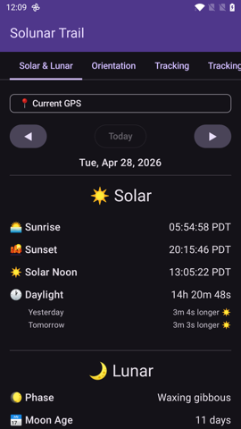
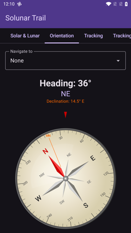
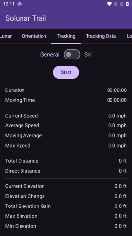
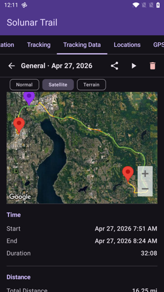
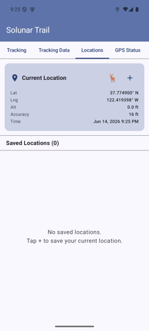
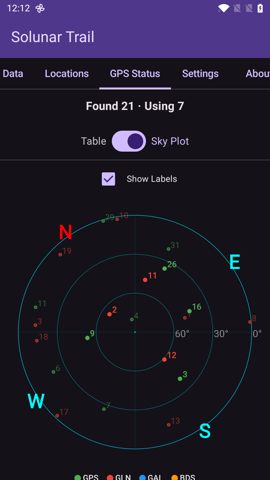
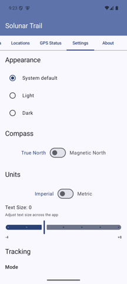
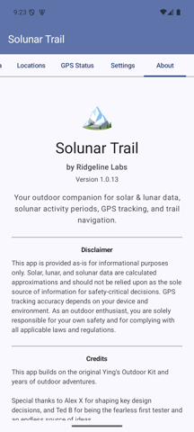

# Solunar Trail User Manual

Last updated: June 14, 2026

**Solunar Trail** is an outdoor companion for solar and lunar data, solunar activity periods, saved places, GPS satellite status, compass / orientation tools, and activity tracking.

## Getting Started

1. Open the app and grant location permission when prompted.
2. Use the **tab bar at the top** (scroll the tabs sideways to see more), or **swipe left/right** on the page, to switch between sections.
3. For best GPS results, use the app outdoors with a clear view of the sky.

The pages, in order, are: **Solar & Lunar · Orientation · Tracking · Tracking Data · Locations · GPS Status · Settings · About**.

> **Safety note:** Solunar Trail is informational only. Do not rely on it as your only source for navigation, weather, emergency communication, or safety-critical decisions.

## Solar & Lunar

Shows sun and moon information for your current location (or a saved location), including solunar activity periods.

<figure>
  
  <figcaption>Solar & Lunar tab — daily sun/moon timings and solunar windows.</figcaption>
</figure>

- **Major periods** are based on moon overhead and underfoot timing.
- **Minor periods** are based on moonrise and moonset timing.
- **Dawn/dusk overlap** may indicate a stronger activity window.
- The star rating summarizes the day's expected solunar activity.
- Use the date arrows to look at past or future days.

## Orientation

Compass heading, device sensor readings, and an optional "Navigate to" picker.

<figure>
  
  <figcaption>Orientation tab — compass with optional bearing to a saved location.</figcaption>
</figure>

- Pick any saved location from the **Navigate to** dropdown to see its bearing and distance.
- Magnetic declination for your location is shown next to the heading.
- Switch between **True North** and **Magnetic North** in Settings → Compass.
- Compass accuracy depends on your device sensors and nearby magnetic interference. Move away from metal/electronics and recalibrate if the heading looks wrong.

## Tracking

Records your route and activity stats locally on your device.

<figure>
  
  <figcaption>Tracking tab — Start to begin recording, then live stats appear.</figcaption>
</figure>

1. Pick the tracking mode in Settings if needed (**General** or **Ski**).
2. Tap **Start** to begin recording.
3. Use **Pause** and **Resume** to temporarily stop/resume the timer and GPS collection.
4. Tap **Stop** to finish, then choose **Save** or **Discard**.

### Lap / Segment Markers (General mode)

- Tap **⛳ Lap** to drop a segment boundary during a recording.
- A live **Segments** count appears after the first lap.
- Per-segment stats include distance, elevation gain, duration, moving time, and average moving speed.
- If you tap Lap again before a new GPS point is captured, the app asks you to move a bit before the next lap instead of creating an empty segment.

## Tracking Data

Browse, replay, edit, export, or delete your saved tracks.

<figure>
  
  <figcaption>Tracking Data tab — expanded track with route map, stats, and actions.</figcaption>
</figure>

- Tap a track to expand it and see route stats: distance, duration, moving time, elevation, speed, GPS point count, and a per-segment breakdown when markers exist.
- **Replay** the track on the map at adjustable speed (with pause/play).
- **Export GPX** to share with other mapping/GPS tools (segment markers are exported as GPX waypoints).
- **Edit Segments** lets you add, remove, or clear segment markers on an already-saved track.
- **Trim** lets you cut unwanted points off the start or end of a recording.
- **Delete** removes the recording.

### Editing Segments

- Use the slider to choose a point along the track.
- **Add** a marker at the selected point, **Remove Nearest**, or **Clear All**.
- Markers divide the track into sections without changing the recorded route.

### Trimming a Track

- Use the start/end sliders to choose how much of the recording to keep.
- **Reset** restores the full original range; **Save Trim** writes the trimmed version.

## Locations

Saved positions for repeat outdoor spots — trailheads, overlooks, stands, camps, or fishing areas.

<figure>
  
  <figcaption>Locations tab — current GPS at the top, saved places below.</figcaption>
</figure>

- Tap **+** to save your current GPS position with a custom title and notes.
- Tap **🦌** for a quick-save Game Sighting (auto-named with timestamp).
- Tap a saved location to expand its details and access actions.
- **Edit** the title, notes, or lock state; **📋 Copy** the coordinates; **GPS Update** to refresh from your current fix (unless the location is locked).
- Switch the embedded map between **Normal / Satellite / Terrain**.
- Saved locations also appear in the Solar & Lunar location picker and the Orientation "Navigate to" dropdown.

## GPS Status

Live satellite information from the device's GNSS receiver.

<figure>
  
  <figcaption>GPS Status tab — Sky Plot showing satellites by constellation, with elevation rings.</figcaption>
</figure>

- Header shows satellites **Found** and **Using** counts.
- Switch between **Table** (per-satellite list with constellation, SNR, and used-in-fix flag) and **Sky Plot** (polar plot with azimuth/elevation rings) via the toggle, or set the default in Settings → GPS View.
- The Sky Plot has an optional **Show Labels** toggle.

## Settings

<figure>
  
  <figcaption>Settings tab — appearance, units, tracking, GPS, and more.</figcaption>
</figure>

- **Appearance:** Theme (System / Light / Dark) and Text Size adjustment.
- **Compass:** True North or Magnetic North.
- **Units:** Imperial or Metric.
- **Tracking:** Mode (General / Ski) and, in Ski mode, the Lift Detection Range.
- **GPS:**
    - **Min Distance Filter** — minimum movement to trigger a GPS update during tracking.
    - **Smart Filter** — Off or Smart (starts at 0 m and ramps up to the configured value once tracking stabilizes).
    - **Stationary Update Interval** — how often to request location when you're not moving (2 s / 4 s / 8 s / 16 s / Off).
    - **Auto-save Interval** — periodically save tracking data to protect against process death (5 / 10 / 15 / 30 min / Off).
    - **Max Replay Duration** — hides replay speeds that would exceed this duration.
- **OEM Battery Settings:** When enabled, the battery-optimization step also tries the manufacturer-specific battery page (e.g. OxygenOS) for whitelisting.
- **GPS View:** Default for GPS Status — Table or Sky Plot.
- **⭐ Rate This App** and **Reset to Defaults** are at the bottom.

## About

App version, disclaimer, credits, attribution, and quick links to the User Manual and Privacy Policy.

<figure>
  
  <figcaption>About tab — version info and project credits.</figcaption>
</figure>

## Maps and GPX Export

Map views use Google Maps to display locations and tracks. Saved tracks can be exported as GPX files for use in other mapping or GPS tools.

## Privacy and Data

Solunar Trail stores saved locations, preferences, and recorded tracks locally on your device. It does not include analytics, advertising, or crash reporting SDKs. See the [Solunar Trail Privacy Policy](/ridgeline-labs/privacy-policy.html) for details.

## Troubleshooting

- **No GPS fix:** go outdoors, enable device location, and wait for a clear fix.
- **Tracking looks stationary:** your device may not have received a new GPS point yet; move a short distance and wait for the next fix.
- **Compass seems wrong:** move away from metal objects/electronics and recalibrate the device sensors.
- **Map does not load:** check network connectivity. Google Maps tiles require network access.
- **Tracking stops in the background:** enable the *OEM Battery Settings* step in Settings and whitelist Solunar Trail in your phone's battery optimization page.

## Contact

For questions or support, contact:

**yxieca@gmail.com**
